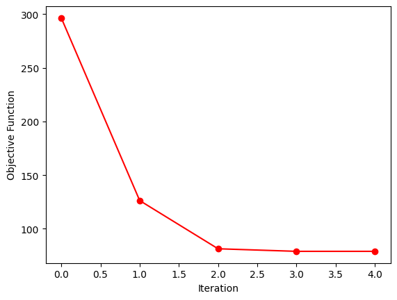
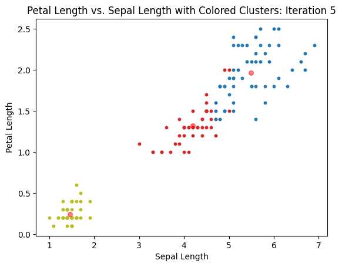
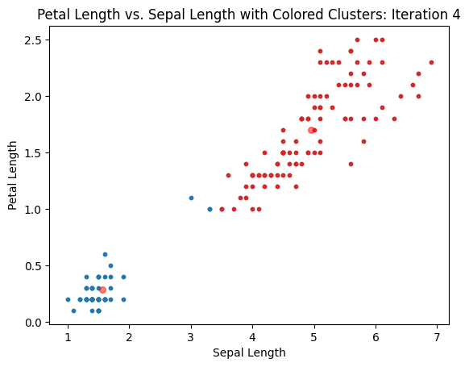
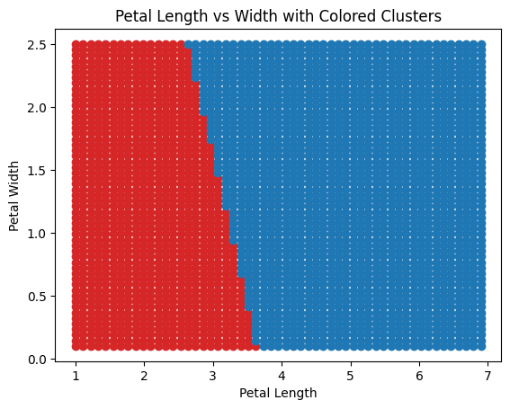
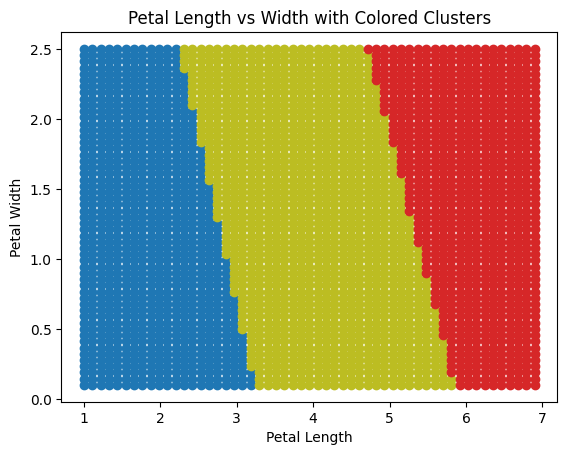
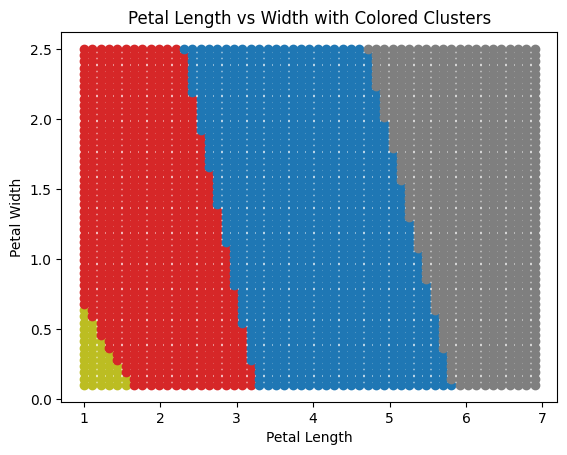
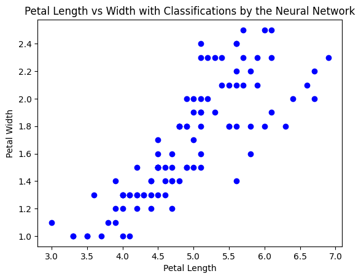
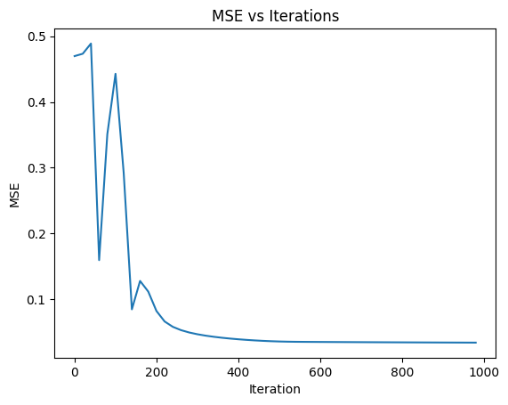
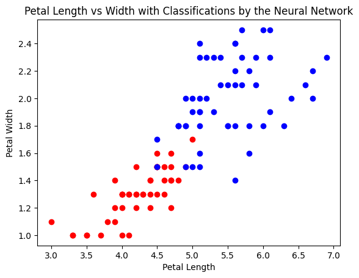

# csds391-pa2

Repository for PA2 of CSDS391 (AI)

## Set up instructions

1. Load main.ipynb in a Jupyter Notebook environment.
2. Ensure the Python interpreter is the virtual environment included in this project submission.

    Alternatively, make sure the following libraries are installed:

    - matplotlib
    - numpy

3. Start main.ipynb through Jupyter

## Write-up

### Clustering

(A) Implement k-mean clustering with the objective function and learning rule from WA4-Q1.

Done. See the code in "KMeansClustering.py"

(B) Plot the value of the objective function as a function of the iteration to show that the learning rule and implementation minimizes the following expression.

$$ D = \sum_{n=1}^N\sum_{k=1}^N{r_{n,k} || x_n - \mu_k ||^2} $$

(C) Plot the results of the learning process by showing the initial, intermediate, and converged cluster centers overlaid on the data for $ k = 2 $ and $ k = 3 $.

See figures below for the convergence when $ k = 3 $

See figures below for the convergence when $ k = 2 $

(D) Devise a method to plot the decision boundaries for the dataset using the optimized parameters.

My idea for plotting the decision boundaries was to categorize a grid of points, and then to display those. This was from one of my peers (Rithvik) who tried this first. The idea is that by categorizing every point on the window, you can see how any points would be categorized by the particular clusters the algorithm has fallen into. This works equally well for any value of $ k $ because the plotting method does not change. I have included some figures below that demonstrate how this works for various values of $ k $.

### Neural Networks

(A) Write a program to calculate the MSE of the data for a simple one-layer neural network using a sigmoid non-linearity. The function should take 3 arguments: the data vectors, the parameters defining the neural network, and the pattern classes.

See the NeuralNetwork class and Training.MSE function in NeuralNetwork.py. The functionality of these functions is demonstrated in their use to answer the questions below.

(B) Compute the MSE for two different settings of the weights. Hand-select these weights to give large and small errors. Plot both boundaries on the dataset. Only use the 2nd and 3rd iris classes.

#### Low MSE

Weights: [-4.12, -3.91, 5.61, 5.76]

MSE = 0.03386

#### High MSE

Weights: [0.076, -0.078, 1.10, 0.73]

MSE = 0.496559

(C) and (D) Give a mathematical derivation of the gradient of the objective function with respect to the weights. Use $ w_0 $ to represent the bias term. Show and explain each step. Show how the gradient can be written in both scalar and vector form.

The objection function can be written mathematically

$$ E = \frac{1}{N}\sum^N_{i=1}(y_i - \hat{y}_i)^2 $$

In this simple neural network, $ \hat{y}_i $ is given by the following expression:

$$ \hat{y}_i = \sigma(w_0 + \mathbf{w}\cdot\mathbf{x}) $$

Where $ w_0 $ is the bias term, $ \mathbf{w} $ is the weights from the input layer to the output layer, $ \mathbf{x} $ is the parameter vector, and $ \sigma(z) = \frac{1}{1 + e^{-z}} $. Note that the derivative of the sigmoid function is $ \sigma(z)(1-\sigma(z)) $.

We are solving for the gradient which can be found by evaluating $ \frac{\delta E}{\delta \mathbf{w}} $

$$ \frac{\delta E}{\delta \mathbf{w}} = \frac{\delta E}{\delta z} \cdot \frac{\delta z}{\delta \mathbf{w}} $$

This allows us to simplify the math as we can solve for the two parts separately.

$$ \frac{\delta E}{\delta z} = \frac{\delta}{\delta z}(\frac{1}{N}\sum^N_{i=1}(y_i - \hat{y}_i)^2) = -\frac{2}{N}\sum^N_{i=1}(y_i - \sigma(w_0 + \mathbf{w}\cdot\mathbf{x}))\sigma(w_0 + \mathbf{w}\cdot\mathbf{x})(1-\sigma(w_0 + \mathbf{w}\cdot\mathbf{x}))$$

$$ \frac{\delta z}{\delta \mathbf{w}} = \frac{\delta}{\delta \mathbf{w}}(w_0 + \mathbf{w}\cdot\mathbf{x}) = \mathbf{x} $$

Of course, $ \frac{\delta z}{\delta w_0} $ is the exception as it equals 1. We can combine the partial derivatives above to get the gradient.

$$ \frac{\delta E}{\delta \mathbf{w}} = -\frac{2}{N}\sum^N_{i=1}(y_i - \sigma(w_0 + \mathbf{w}\cdot\mathbf{x}))\sigma(w_0 + \mathbf{w}\cdot\mathbf{x})(1-\sigma(w_0 + \mathbf{w}\cdot\mathbf{x}))\mathbf{x}_i $$

In scalar form it is:

$$ \frac{\delta E}{\delta \mathbf{w}_j} = -\frac{2}{N}\sum^N_{i=1}(y_i - \sigma(w_0 + \mathbf{w}\cdot\mathbf{x}_i))\sigma(w_0 + \mathbf{w}\cdot\mathbf{x}_i)(1-\sigma(w_0 + \mathbf{w}\cdot\mathbf{x}_i))\mathbf{x}_{i,j} $$

(E) Write code that computes the summed gradient for an ensemble of patterns. Illustrate the gradient by showing how the decision boundary changes for a small step.

See figure for how the MSE changes.

See the two figures below. The first is the starting classification boundaries. The second is the final classification boundary. The final figure it a classification boundary from an iteration that is closer to the final classification boundary.

## Work Log

1. Set up the project

    I created the basic file structure, created empty files, and read through the instructions.

2. Figure out what to do

    I re-read the instructions and consulted my friends who have started the project.

3. Import and parse the data

    I created a class (IrisData) that reads the data in the "iris.data" file and parses it. It stores the data in a 2D array.

4. Review the k-means clustering algorithm so that I can implement it.

    Still WIP as of 04-15-2023. I am also consulting [Rohan's work](https://github.com/Rohan-s18/Artificial_Intelligence/tree/main/AI-based%20implementations/Iris%20classification) as reference material.

5. Outline the class that will do k-means clustering

    I added a basic outline with the objective function, and cluster updates. The class still doesn't have a stopping mechanism except for the maxIter parameter, but I'm going to move ahead with visualization so that I can see where my code is at.

6. Add visualization of k-means

    I added visualization of the objection function decreasing and a scatter plot of the clusters. Using this, I was able to debug the code.

7. Add what I can to the write up for k-means

    Done. I will have to save part D for another time.

8. Figure out what to do for Neural Networks

    I worked with my peers who have started with on this section to figure out what I need to do. I realized that I need to convert the labels to integers so that I can calculate the MSE. After that, I will need to set up the class to construct and perform operations on the neural network.

9. Rework the Iris data class for the neural network

    Done. I converted the labels to integers and made a few changes so to the k-means code as well.

10. Set up architecture of the neural network

    I set up the neural network and the calculation of MSE, but this does not include any training of the network. However, doing the MSE step allowed me to answer 2.A and 2.B.

11. Remove class one from the neural network data

    Done. This gave me better answers for 2.B

12. Derive the answers for 2.C and 2.D

    I tried my best on both of these. I think they're correct, but I'll find out when I try 2.E I suppose.

13. Try implementing the math in 2.C and 2.D for 2.E

    Done. It's not perfect but it works. On to the next thing.

14. Plots for 2.B

    Done. It doesn't have a line as the boundary, but I'm going to have to leave it at that for now.

15. Plots for 2.E

    Done.

16. 1.D

    Done.

17. Polish and submit
